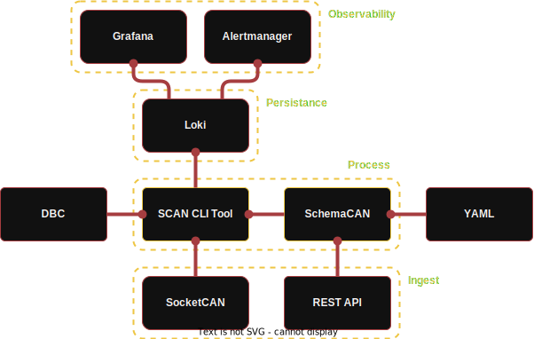

# SchemaCAN

## Design

The system is made up of the following components:
- **SchemaCAN** the specification for defining CAN Bus message formats.
- **SCAN CLI Tool** the runner/utlity that acts as the glue between the components.
- **Loki** the time-series database which stores the CAN Bus messages.
- **Grafana** the data visualisation tool.
- **Alertmanager** the notification handler.

Not all of these components are required. For example Grafana and Alertmanager could be ommitted in favour of consuming data either directly from Prometheus or via the REST API. And so, any third party software that can communicate with Prometheus can also be used.

### Architecture

## Operation

todo

## Management

todo
