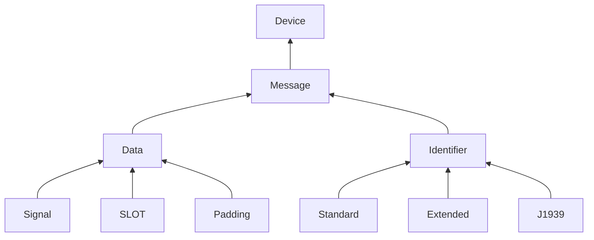

```mermaid
graph BT;
    Message-->Device;
    
    Data-->Message;
    Signal-->Data;
    SLOT-->Data;
    Padding-->Data;
    
    Identifier-->Message;
    Standard-->Identifier;
    Extended-->Identifier;
    J1939-->Identifier;

```
